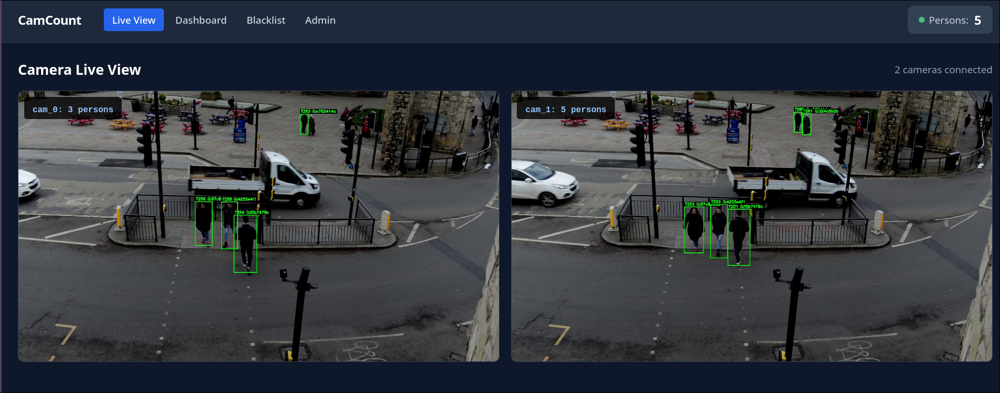
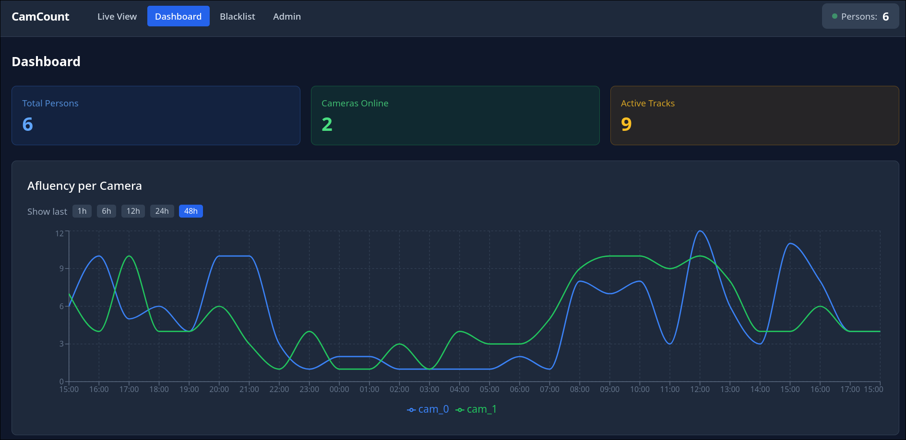

# Camera Person Counting System

Real-time multi-camera person detection, tracking and counting using YOLOv8n, ByteTrack, and ONNX-based ReID (re-identification). Designed for commercial spaces (malls, plazas) as an approximate population sampling system.

## Screenshots

| Live View | Dashboard |
|---|---|
|  |  |

## Features

- **Person detection**: YOLOv8n via ultralytics
- **Per-camera tracking**: ByteTrack (ultralytics built-in)
- **Cross-camera re-identification**: MobileNetV3 ONNX embeddings (cosine similarity)
- **Global identity management**: Redis with configurable TTL (default 10 minutes)
- **MJPEG video stream**: bounding boxes and IDs drawn server-side
- **Dashboard**: React frontend with real-time counts, historical charts, WebSocket updates
- **Authentication**: JWT + bcrypt (admin/viewer roles)
- **Blacklist**: SQLite-backed for flagging persons of interest
- **User management**: CRUD via Admin panel

## Hardware considerations

On a **Ryzen 7900 (12-core CPU)** with 2 cameras at ~5fps, the system uses **40-50% CPU**:

| Component | CPU usage per camera |
|---|---|
| YOLOv8n detection | ~30-50ms/frame |
| ByteTrack tracking | ~1ms/frame |
| ONNX ReID embedding | ~2-3ms/frame (batch) |
| Identity matching + Redis | <1ms/frame |

**Recommendations**:
- Production with 2+ cameras: cap detection at 3-5fps via `DETECTION_INTERVAL`
- Production with 4+ cameras: GPU strongly recommended
- A single NVIDIA RTX 3060+ handles 10+ cameras at full framerate
- For face recognition (future): GPU is mandatory for real-time use

## Quick start

```bash
# 1. Start Redis
docker compose up -d

# 2. Install Python deps (conda env recommended)
pip install -r requirements.txt

# 3. Export ONNX ReID model (one-time)
python scripts/export_reid_onnx.py

# 4. Start backend
python main.py

# 5. Start frontend (separate terminal)
cd frontend && npm run dev

# 6. Open http://localhost:5173
#    Login: admin / admin123
```

## Configuration

Copy `.env.example` to `.env` and adjust:

| Variable | Default | Description |
|---|---|---|
| `CAMERA_SOURCES` | `example/CCTV_example.mp4` | Comma-separated video paths or RTSP URLs |
| `IDENTITY_TTL` | `600` | Seconds before an unseen identity expires |
| `HSV_MATCH_THRESHOLD` | `0.7` | Min cosine similarity for ReID match |
| `HEIGHT_MATCH_THRESHOLD` | `0.15` | Max height difference ratio for match |
| `DETECTION_CONFIDENCE` | `0.5` | YOLO confidence threshold |
| `REDIS_HOST` | `localhost` | Redis connection |
| `JWT_SECRET` | (change me) | JWT signing key — change in production |
| `SQLITE_DB_PATH` | `data/persons.db` | SQLite database path |

## Architecture

```
┌─────────────┐
│  RTSP/Videos │────► CameraReader (per camera)
└─────────────┘           │
                          ▼
                   YOLOv8n + ByteTrack
                          │
                   ┌──────┴──────┐
                   ▼              ▼
            bounding boxes    person crops
                   │              │
                   │         ONNX ReID
                   │         (MobileNetV3)
                   │         1024-dim embedding
                   │              │
                   ▼              ▼
              Identity Manager ◄──┘
              ├─ Cosine similarity > 0.7
              ├─ Height comparison < 15%
              ├─ Redis (global_id, TTL 600s)
              └─ SQLite (events, users, hourly_counts)
                   │
              WebSocket ─► React Frontend
```

## API

| Method | Path | Auth | Description |
|---|---|---|---|
| `GET` | `/api/health` | No | Health check |
| `GET` | `/api/count` | Yes | Current person count |
| `GET` | `/api/count/history?hours=24` | Yes | Hourly historical counts |
| `GET` | `/api/cameras` | Yes | Camera status and active tracks |
| `GET` | `/api/cameras/{id}/mjpeg` | No | MJPEG stream with bounding boxes |
| `GET` | `/api/identities` | Yes | Active global identities |
| `GET` | `/api/events?camera_id=X` | Yes | Event log (enter/exit/heartbeat) |
| `GET` | `/api/blacklist` | Yes | List blacklist entries |
| `POST` | `/api/blacklist` | Admin | Add to blacklist |
| `DELETE` | `/api/blacklist/{id}` | Admin | Deactivate blacklist entry |
| `POST` | `/api/auth/login` | No | Get JWT token (form data) |
| `POST` | `/api/auth/register` | Admin | Create user |
| `GET` | `/api/auth/users` | Admin | List users |
| `WS` | `/ws` | No | Real-time tracking updates |

## Dashboard pages

| Route | Content |
|---|---|
| `/` | Live camera grid with bounding boxes overlay |
| `/dashboard` | Afluency metrics: total persons, cameras online, active tracks, hourly chart |
| `/blacklist` | CRUD for flagged persons |
| `/admin` | User creation and management |

## Testing

```bash
# Test config
python -c "from core.config import settings; print(settings.camera_list)"

# Generate fake historical data for dashboard
python scripts/backfill_counts.py

# Clean Redis
docker exec -it camera-redis redis-cli FLUSHDB

# TypeScript check
cd frontend && npx tsc --noEmit

# Production build
cd frontend && npm run build
```

## Frontend tech stack

- React 18 + TypeScript
- Vite (dev server + build)
- TailwindCSS (styling)
- Recharts (charts)
- React Router (navigation)
- WebSocket (real-time updates)

## Limitations

- **Angle-dependent ReID**: Cross-camera matching degrades with very different camera angles (same person front vs side view). ONNX ReID is more robust than HSV but not perfect.
- **Crowded scenes**: YOLOv8n and ByteTrack struggle with heavy occlusions (>15 simultaneous people).
- **CPU-bound**: No GPU acceleration for ONNX ReID in current config. GPU support available via `onnxruntime-gpu`.
- **Approximate counting**: TTL-based expiry means exits are inferred, not directly detected. Suitable for population sampling (±10%), not for exact headcounts.

## License

Proprietary. All rights reserved.
